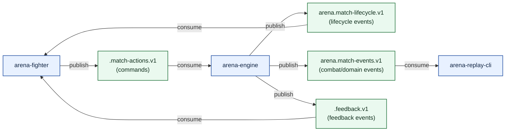
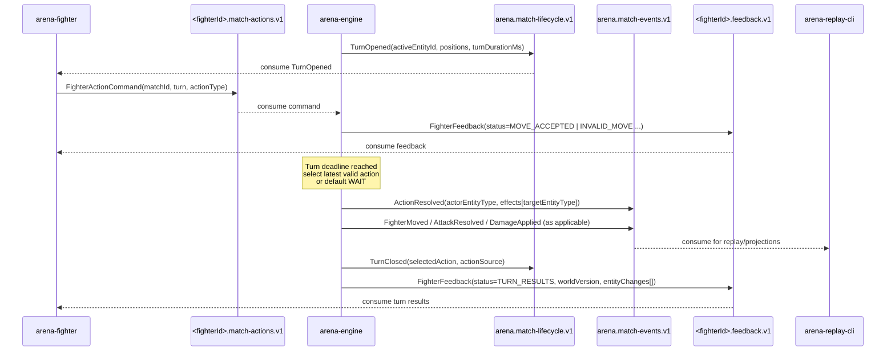

# Event Model

This system is command-and-event driven.

- Fighters publish action commands.
- Engine validates and applies one action per turn.
- Engine publishes lifecycle, combat, and fighter feedback events.

## Intent and Semantics

### Commands vs Events

- A command is a request: "I want to do this action now."
- An event is a fact: "This is what the engine accepted and what happened."
- Commands are not authoritative match history; events are.

### What Is Authoritative

- `arena-engine` is the single authority for turn state and combat resolution.
- `arena.match-lifecycle.v1` and `arena.match-events.v1` are the canonical match timeline.
- Fighter action topics are intent input only.

### Event Envelope and Tracing

All engine events share a stable envelope:

- `eventId`: unique id for idempotency and deduplication in consumers.
- `eventType`: concrete fact type (for example `TurnOpened`, `ActionResolved`).
- `schemaVersion`: schema shape version for readers.
- `occurredAt`: event time emitted by engine.
- `matchId`: aggregate key and Kafka message key.
- `turn`: current turn number for ordering within a match.
- `traceId`: correlation id for end-to-end flow of one match timeline.
- `causationId`: optional upstream cause reference (for chained events).

Tracing guidance:

- Treat `traceId` as a stable per-match correlation id.
- Carry `traceId` through lifecycle, match, and feedback topics.
- When generating derived events, set `causationId` to the triggering `eventId` when available.

### Timing and Turn Semantics

- A turn opens with `TurnOpened` and closes at the configured deadline.
- Engine accepts zero or more commands for the active fighter during that window.
- Engine executes only the latest valid command for that turn.
- If no valid command is present by deadline, engine executes `WAIT`.

### Validation Semantics

- Every accepted/rejected command gets fighter feedback.
- Rejections include reason codes (for example `TURN_MISMATCH`, `NOT_ACTIVE_FIGHTER`, `OUT_OF_BOUNDS`).
- Consumers should use feedback to adapt behavior; they should not infer acceptance from "command sent".

### Consumer Expectations

- Consume events keyed by `matchId`.
- Treat engine events as source of truth.
- Be idempotent when possible (at-least-once processing can redeliver records).
- Do not rely on commands alone to reconstruct match state.

## Topics

| Topic | Key | Produced by | Consumed by | Purpose |
|---|---|---|---|---|
| `arena.match-lifecycle.v1` | `matchId` | `arena-engine` | `arena-fighter` | Match and turn coordination |
| `arena.match-events.v1` | `matchId` | `arena-engine` | `arena-replay-cli` (and extensions) | Combat outcomes and replayable state changes |
| `<fighterId>.match-actions.v1` | `matchId` | `arena-fighter` | `arena-engine` | Fighter turn commands |
| `<fighterId>.feedback.v1` | `matchId` | `arena-engine` | matching `arena-fighter` | Command validation + per-turn results |



## Command Contract

Fighter command (`FighterActionCommand`):

```json
{
  "matchId": "26519223-552c-42cb-baaf-789d798fd06b",
  "turn": 10,
  "fighterId": "balanced",
  "commandId": "a2f5bd4a-c33a-4fc2-9dd2-4df97e3440cc",
  "actionType": "ATTACK",
  "targetEntityId": "glass-cannon",
  "sentAt": "2026-03-04T09:24:14.511Z"
}
```

`actionType` values:

- `MOVE_UP`
- `MOVE_DOWN`
- `MOVE_LEFT`
- `MOVE_RIGHT`
- `ATTACK`
- `WAIT`

Command expectations:

- `matchId`, `turn`, and `fighterId` must match the currently active turn.
- `commandId` should be stable per submitted command and is used for feedback causation.
- `targetEntityId` is optional; current engine uses active opponent for two-fighter matches.
- Sending multiple commands in one turn is allowed; last valid one wins.
- A sent command might be rejected; check `<fighterId>.feedback.v1` for outcome.

## Lifecycle Events

Published to `arena.match-lifecycle.v1`.

- `MatchScheduled`
- `MatchStarted`
- `TurnOpened`
- `TurnClosed`

Lifecycle event purpose:

- Coordinate pilots and observers through match phases.
- Provide fighter-facing turn context (`actingFighterId`, coordinates, turn duration).
- Publish which action was actually executed (`TurnClosed.selectedAction`).

Example `TurnOpened`:

```json
{
  "eventType": "TurnOpened",
  "matchId": "26519223-552c-42cb-baaf-789d798fd06b",
  "turn": 10,
  "payload": {
    "actingFighterId": "balanced",
    "targetFighterId": "glass-cannon",
    "actingPosition": { "x": 4, "y": 2 },
    "targetPosition": { "x": 5, "y": 2 },
    "turnDurationMs": 1000,
    "boardWidth": 7,
    "boardHeight": 5,
    "actorAttackRange": 1,
    "visibleEntities": [
      {
        "entityId": "cover-a",
        "entityType": "COVER",
        "faction": "NEUTRAL",
        "position": { "x": 3, "y": 2 },
        "attributes": { "coverBonus": "0.20" }
      }
    ]
  }
}
```

Example `TurnClosed`:

```json
{
  "eventType": "TurnClosed",
  "matchId": "26519223-552c-42cb-baaf-789d798fd06b",
  "turn": 10,
  "payload": {
    "actingFighterId": "balanced",
    "selectedAction": "ATTACK",
    "actionSource": "FIGHTER"
  }
}
```

## Combat Events

Published to `arena.match-events.v1`.

- `FighterMoved`
- `EntitySpawned`
- `EntityRemoved`
- `ActionResolved`
- `AttackResolved`
- `DamageApplied`
- `MatchEnded`

Combat event purpose:

- Emit replayable domain facts about board and damage state.
- Enable downstream projections (UI, stats, commentary, betting) without coupling to engine internals.

Example `FighterMoved`:

```json
{
  "eventType": "FighterMoved",
  "matchId": "26519223-552c-42cb-baaf-789d798fd06b",
  "turn": 8,
  "payload": {
    "fighterId": "balanced",
    "fromPosition": { "x": 3, "y": 2 },
    "toPosition": { "x": 4, "y": 2 }
  }
}
```

Example `EntitySpawned`:

```json
{
  "eventType": "EntitySpawned",
  "matchId": "26519223-552c-42cb-baaf-789d798fd06b",
  "turn": 4,
  "payload": {
    "entityId": "pickup-4-2c473d",
    "entityType": "ITEM",
    "faction": "NEUTRAL",
    "position": { "x": 2, "y": 3 },
    "attributes": { "kind": "ATTACK_BOOST_5" }
  }
}
```

Example `EntityRemoved`:

```json
{
  "eventType": "EntityRemoved",
  "matchId": "26519223-552c-42cb-baaf-789d798fd06b",
  "turn": 10,
  "payload": {
    "entityId": "pickup-4-2c473d",
    "entityType": "ITEM",
    "faction": "NEUTRAL",
    "reason": "PICKUP_COLLECTED",
    "position": { "x": 2, "y": 3 },
    "attributes": { "kind": "ATTACK_BOOST_5" }
  }
}
```

Example `ActionResolved`:

```json
{
  "eventType": "ActionResolved",
  "matchId": "26519223-552c-42cb-baaf-789d798fd06b",
  "turn": 10,
  "payload": {
    "actorEntityId": "balanced",
    "actorEntityType": "FIGHTER",
    "actorFaction": "BLUE",
    "actionType": "ATTACK",
    "outcome": "SUCCESS",
    "effects": [
      {
        "effectType": "DAMAGE",
        "targetEntityId": "glass-cannon",
        "targetEntityType": "FIGHTER",
        "targetFaction": "RED",
        "amount": 14,
        "critical": false,
        "metadata": { "coverApplied": "true", "range": "2" }
      }
    ]
  }
}
```

Mechanics represented in events:

- random pickups and cover are represented as first-class `EntitySpawned` / `EntityRemoved` events.
- ranged attacks use fighter profile `attackRange`; outcomes are reflected in `ActionResolved`.
- cover is represented as `entityType=COVER`; attack metadata indicates when cover modifiers applied.
- health regeneration appears as `ActionEffect(effectType=HEAL, metadata.source=regen)` and `EntityChange` hp updates.

## Feedback Events

Published to `<fighterId>.feedback.v1` as `FighterFeedback`.

Feedback event purpose:

- Tell a fighter whether a submitted command was accepted.
- Explain rejections with reason codes.
- Provide per-turn post-resolution status (`TURN_RESULTS`) with typed entity changes.
- Link immediate validation feedback to the source command via `causationId=commandId`.

`status` values:

- `MOVE_ACCEPTED`
- `INVALID_MOVE`
- `TOO_LATE`
- `WRONG_TURN`
- `TURN_RESULTS`

Feedback status field expectations:

| Status | actionType | reasonCode | actorEntityId | worldVersion | entityChanges |
|---|---|---|---|---|---|
| `MOVE_ACCEPTED` | present | null | present | null | empty |
| `INVALID_MOVE` | present | present | present | null | empty |
| `TOO_LATE` | present | present | present | null | empty |
| `WRONG_TURN` | present | present | present | null | empty |
| `TURN_RESULTS` | optional | null | present | present | present |

Example validation feedback:

```json
{
  "eventType": "FighterFeedback",
  "matchId": "26519223-552c-42cb-baaf-789d798fd06b",
  "turn": 10,
  "payload": {
    "fighterId": "balanced",
    "status": "MOVE_ACCEPTED",
    "actionType": "ATTACK",
    "reasonCode": null,
    "actorEntityId": "balanced",
    "worldVersion": null,
    "entityChanges": []
  }
}
```

Example turn result feedback:

```json
{
  "eventType": "FighterFeedback",
  "matchId": "26519223-552c-42cb-baaf-789d798fd06b",
  "turn": 10,
  "payload": {
    "fighterId": "balanced",
    "status": "TURN_RESULTS",
    "actionType": "ATTACK",
    "reasonCode": null,
    "actorEntityId": "balanced",
    "worldVersion": 10,
    "entityChanges": [
      {
        "entityId": "balanced",
        "entityType": "FIGHTER",
        "changeType": "ATTRIBUTE",
        "position": { "x": 4, "y": 2 },
        "attributes": { "hp": "79" }
      },
      {
        "entityId": "glass-cannon",
        "entityType": "FIGHTER",
        "changeType": "ATTRIBUTE",
        "position": { "x": 5, "y": 2 },
        "attributes": { "hp": "66" }
      }
    ]
  }
}
```

## One Turn Sequence



1. Engine emits `TurnOpened`.
2. Active fighter publishes command to `<fighterId>.match-actions.v1`.
3. Engine validates command and emits `FighterFeedback` (`MOVE_ACCEPTED` or rejection).
4. Turn window closes.
5. Engine executes latest valid command (or defaults to `WAIT`).
6. Engine emits combat events (`ActionResolved`, `FighterMoved`, `AttackResolved`, `DamageApplied`) as applicable.
7. Engine emits `TurnClosed` and `TURN_RESULTS` feedback.
